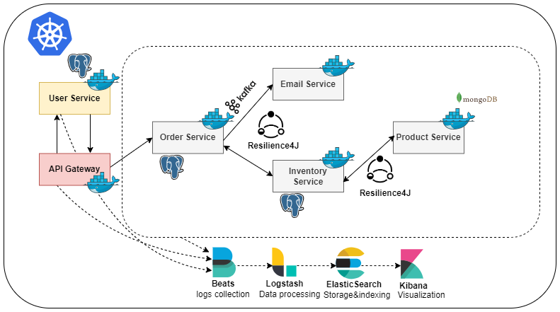
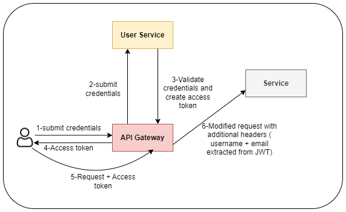

# Spring Boot Microservices E-Commerce Project

This project is a microservices-based e-commerce system built with Spring Boot and deployed on Kubernetes. The application uses JWT-based security, ensuring secure communication between microservices.

## Prerequisites
- Docker
- Kubernetes (Kind)
- Docker Hub account
- Mail host credentials for the email service

## Services Overview

The system consists of several microservices, each handling a different part of the e-commerce system. These services communicate with each other using Feign Clients and are secured using JWT (JSON Web Tokens). The API Gateway is responsible for routing requests to the appropriate microservice, while Kibana, part of the Elastic Stack, is used for log aggregation and monitoring.

### Microservices:
- **Product Service**: Manages products and product details.
- **Order Service**: Handles orders and transactions.
- **Inventory Service**: Manages product inventory and availability.
- **User Service**: Manages user information and authentication.
- **Email Service**: Sends notifications and order confirmation emails.
- **API Gateway**: Routes all client requests to appropriate services.
- **Kibana**: Provides log aggregation and monitoring.

## Tech Stack

The project leverages the following technologies:

- **Java 21**: Core programming language.
- **Spring Boot**: Framework for microservices.
- **Maven**: Build automation and dependency management.
- **Elastic Stack (Filebeat, Logstash, Elasticsearch, Kibana)**: For log aggregation and monitoring.
    - **Filebeat**: Collects data from log files and sends it to Logstash.
    - **Logstash**: Enhances the data and sends it to Elasticsearch.
    - **Elasticsearch**: Stores and indexes the data.
    - **Kibana**: Displays the data stored in Elasticsearch for visualization and monitoring.
- **Kafka**: Event streaming and messaging between services.
- **PostgreSQL**: Relational database for structured data.
- **MongoDB**: NoSQL database for unstructured data.
- **Kubernetes**: Container orchestration and microservice deployment.
- **Feign Client**: Simplified HTTP client for inter-service communication.
- **API Gateway using Spring Cloud Gateway**: Routes and filters requests.
- **Docker**: Containerization platform used to package and distribute the microservices.

## Architecture

The architecture of the system illustrates how various microservices interact with each other. Each microservice is independently deployed within Kubernetes and communicates via the API Gateway.



## Security Architecture
Below is an overview of the Security Architecture, illustrating how the system ensures secure communication and access control across the microservices.



## Step 1: Configure Email Service

1. Go to `email-service/src/main/resources/application.properties`.
2. Enter your mail host credentials:

```
spring.mail.host=smtp.example.com
spring.mail.port=587
spring.mail.username=your-email@example.com
spring.mail.password=your-password
```

## Step 2: Build Docker Images

Navigate to the root of each service and build the Docker images:

```bash
docker build -t product-service:latest ./product-service
docker build -t order-service:latest ./order-service
docker build -t inventory-service:latest ./inventory-service
docker build -t user-service:latest ./user-service
docker build -t email-service:latest ./email-service
docker build -t api-gateway:latest ./api-gateway
```

## Step 3: Push Docker Images to DockerHub

Replace `your-dockerhub-username` with your Docker Hub username, then push the images:

```bash
docker tag product-service:latest your-dockerhub-username/product-service:latest
docker push your-dockerhub-username/product-service:latest

docker tag order-service:latest your-dockerhub-username/order-service:latest
docker push your-dockerhub-username/order-service:latest

docker tag inventory-service:latest your-dockerhub-username/inventory-service:latest
docker push your-dockerhub-username/inventory-service:latest

docker tag user-service:latest your-dockerhub-username/user-service:latest
docker push your-dockerhub-username/user-service:latest

docker tag email-service:latest your-dockerhub-username/email-service:latest
docker push your-dockerhub-username/email-service:latest

docker tag api-gateway:latest your-dockerhub-username/api-gateway:latest
docker push your-dockerhub-username/api-gateway:latest
```

## Step 4: Update Kubernetes Manifest Files

In the Kubernetes manifest files (`.yaml`), replace my DockerHub username with yours.

```yaml
image: your-dockerhub-username/product-service:latest
image: your-dockerhub-username/order-service:latest
# and so on for other services
```

## Step 5: Create Kubernetes Cluster

Run the following script to create the Kind Kubernetes cluster and pre-load Docker images into the cluster:

```bash
./k8s/kind/create-kind-cluster.sh
```

## Step 6: Deploy the Infrastructure

Deploy the infrastructure (such as Elastic Stack, Kafka, etc.) using the following command:

```bash
kubectl apply -f k8s/manifests/infrastructure.yaml
```

## Step 7: Deploy the Services

Deploy the microservices to Kubernetes using the following command:

```bash
kubectl apply -f k8s/manifests/applications.yaml
```

## Step 8: Access the API Gateway

To access the API Gateway, run the following command to port-forward the service to your local machine:

```bash
kubectl port-forward svc/api-gateway 8090:8090
```

You can now access the API Gateway at `http://localhost:8090`.

## Step 9: Access Kibana

You can also access Kibana for log aggregation. Use the following command to forward the Kibana port:

```bash
kubectl port-forward svc/kibana 5601:5601
```

You can now access Kibana at `http://localhost:5601`.

## Conclusion

The application is now running on Kubernetes, and you can access the services via the API Gateway or Kibana for monitoring logs.